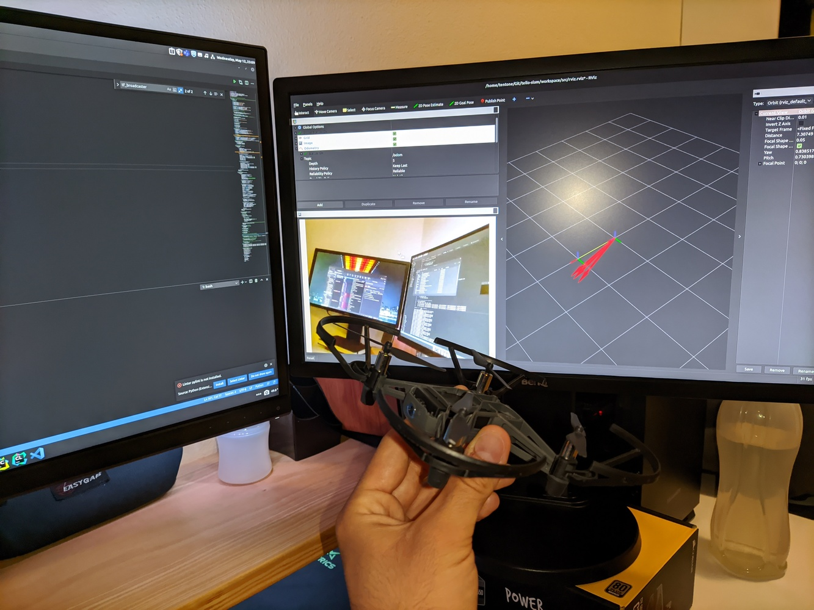
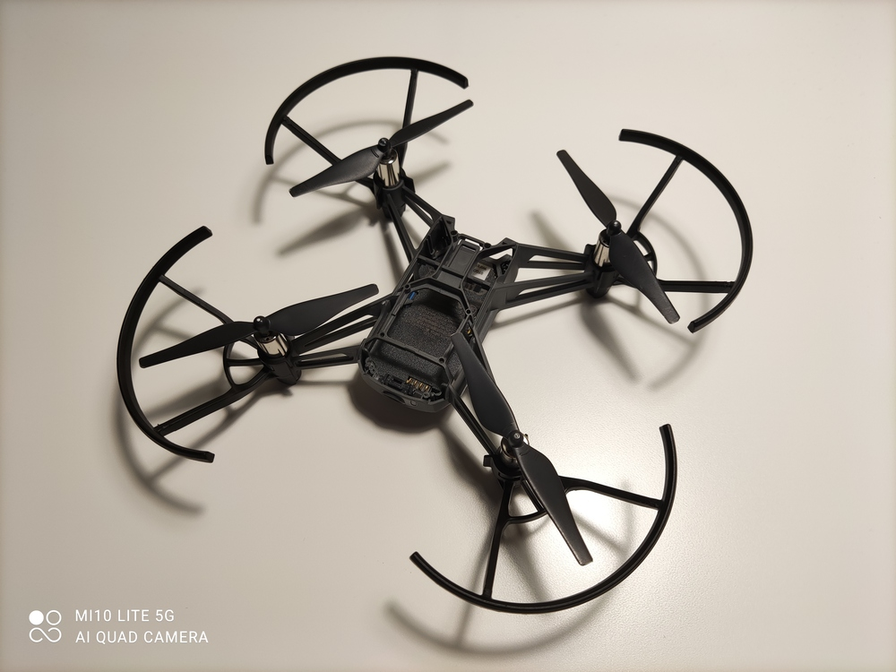
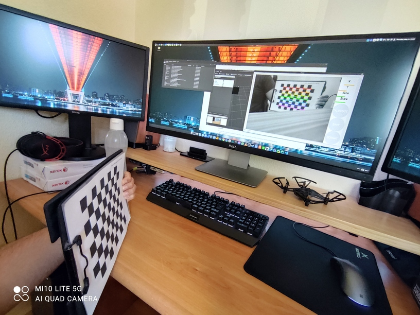
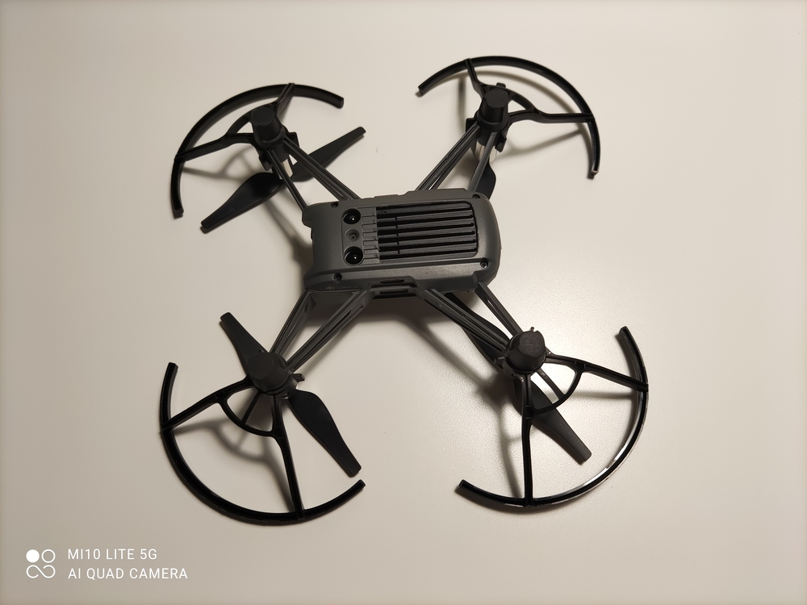

# DJI Tello ROS2
- [DJI Tello](https://www.ryzerobotics.com/tello) driver for ROS 2 based on [DJITelloPy](https://github.com/damiafuentes/DJITelloPy) that uses the [official SDK](https://github.com/dji-sdk/Tello-Python) for the drone.
- Can be used to control multiple drones both using the swarm functionality (only for [Tello EDU](https://www.ryzerobotics.com/tello-edu)) or using multiple WLAN with regular [Tello](https://www.ryzerobotics.com/tello) drones.
- This project was developed as a way of learning ROS 2 and evaluate the viability of moving other in progress projects from ROS 1 to ROS 2.
- Ii is recommended to update the Tello firmware to the latest version available 
- Project workspace is divided into sub-workspaces that contain different logic.
  - `tello` package is the main package, includes access to the drone information, camera image and  control.
  - `tello_msg` package defines custom messages to access specific Tello data.
    - Defines the `TelloStatus`, `TelloID` and `TelloWifiConfig` messages 
  - `tello_control` package is a sample control package that displays the drone image and provides keyboard control.
    - T used for takeoff, L to land the drone, F to flip forward, E for emergency stop, WASD and arrows to control the drone movement.



- Bellow is the list of topics published and consumed by the `tello` package
- The list of published topics alongside their description and frequency. These topics are only published when some node subscribed to them, otherwise they are not processed.

| Topic        | Type                           | Description                                                  | Frequency |
| ------------ | ------------------------------ | ------------------------------------------------------------ | --------- |
| /image_raw   | sensor_msgs/Image              | Image of the Tello camera                                    | 30hz      |
| /camera_info | sensor_msgs/CameraInfo         | Camera information (size, calibration, etc)                  | 2hz       |
| /status      | tello_msg/TelloStatus          | Status of the drone (wifi strength, batery, temperature, etc) | 2hz       |
| /id          | tello_msg/TelloID              | Identification of the drone w/ serial number and firmware    | 2hz       |
| /imu         | sensor_msgs/Imu                | Imu data capture from the drone                              | 10hz      |
| /battery     | sensor_msgs/BatteryState       | Battery status                                               | 2hz       |
| /temperature | sensor_msgs/Temperature        | Temperature of the drone                                     | 2hz       |
| /odom        | nav_msgs/Odometry              | Odometry (only orientation and speed)                        | 10hz      |
| /tf          | geometry_msgs/TransformStamped | Transform from base to drone tf, prefer a external publisher. | 10hz      |

- The list of topics subscribed by the node, these topics can be renamed in the launch file.

| Topic        | Type                      | Description                                                  |
| ------------ | ------------------------- | ------------------------------------------------------------ |
| \emergency   | std_msgs/Empty            | When received the drone instantly shuts its motors off (even when flying), used for safety purposes |
| \takeoff     | std_msgs/Empty            | Drone takeoff message, make sure that the drone has space to takeoff safely before usage. |
| \land        | std_msgs/Empty            | Land the drone.                                              |
| \control     | geometry_msgs/Twist       | Control the drone analogically. Linear values should range from -100 to 100, speed can be set in x, y, z for movement in 3D space. Angular rotation is performed in the z coordinate. Coordinates are relative to the drone position (x always relative to the direction of the drone) |
| \flip        | std_msgs/String           | Do a flip with the drone in a direction specified. Possible directions can be "r" for right, "l" for left, "f" for forward or "b" for backward. |
| \wifi_config | tello_msg/TelloWifiConfig | Configure the wifi credential that should be used by the drone. The drone will be restarted after the credentials are changed. |

- The list of parameters used to configure the node. These should be defined on a launch file.

| Name             | Type    | Description                                                  | Default        |
| ---------------- | ------- | ------------------------------------------------------------ | -------------- |
| connect_timeout  | float   | Time  (seconds) until the node is killed if connection to the drone is not available. | 10.0           |
| tello_ip         | string  | IP of the tello drone. When using multiple drones multiple nodes with different IP can be launched. | '192.168.10.1' |
| tf_base          | string  | Base tf to be used when publishing data                      | 'map'          |
| tf_drone         | string  | Name of the drone tf to use when publishing data             | 'drone'        |
| tf_pub           | boolean | If true a static TF from tf_base to tf_drone is published    | False          |
| camera_info_file | string  | Path to a YAML camera calibration file (obtained with the calibration tool) | ''             |


### Camera Calibration

- To allow the drone to be used for 3D vision tasks, as for example monocular SLAM the camera should be first calibrated.
- A sample calibration file is provided with parameters captures from the drone used for testing but it is recommended to perform individual calibrations for each drone used.
- Calibration can be achieved using the [camera_calibration](https://navigation.ros.org/tutorials/docs/camera_calibration.html) package. Calibration pattern can be generated using the [calib.io pattern generator](https://calib.io/pages/camera-calibration-pattern-generator) tool.

```bash
ros2 run camera_calibration cameracalibrator --size 7x9 --square 0.16 image:=/image_raw camera:=/camera_info
```

- Take as many frame as possible and measure your check board grid size to ensure good accuracy in the process. When the process ends a `calibrationdata.tar.gz` will be created in the `/tmp` path.




### Launch File

- Launch files in ROS2 are now defined using python code. To launch the main node of the project add the following code to your `launch.py` file.

```python
Node(
    package='tello',
    executable='tello',
    namespace='/',
    name='tello',
    parameters=[
        {'tello_ip': '192.168.10.1'}
    ],
    remappings=[
        ('/image_raw', 'camera')
    ],
    respawn=True
)
```


### Overheating Problems

- The motor drivers in the DJI Tello overheat after a while when the drone is not flying. To cool down the drivers i have removed the plastic section on top of the heat spreader (as seen in the picture).
- If you are comfortable with leaving the PCB exposed removing the plastic cover should result in even better thermals.
- If possible place the drone on top of an old computer fan or use a laptop cooler to prevent the drone from shutting down due to overheating.



### Install

- To install the driver download the code from git, install dependencies using the `script/install.sh` script.
- After all dependencies are installed build the code and and install using `colcon` as usual or use the `script/build.sh` and `script/run.sh` to test the code.


### Visual SLAM

- The drone is equipped with a IMU and a camera that can be used for visual SLAM in order to obtain the location of the drone and a map of the environment.
- [ORB SLAM 2](https://github.com/raulmur/ORB_SLAM2) is a monocular visual based algorithm for SLAM that can be easily integrated with the Tello drone using this package.
- The wrapper provided alongside with this repository is based on the [alsora/ros2-ORB-SLAM2](https://github.com/alsora/ros2-ORB_SLAM2/tree/f890df18983ead8cd2ae36676036d535ee52951b) project using the [alsora/ORB_SLAM2](alsora/ORB_SLAM2) modified version of ORB Slam that does not depend on pangolin.
- To run the monocular SLAM node after installing all dependencies and building the package run.

```bash
ros2 run ros2_orbslam mono <VOCABULARY FILE> <CONFIG_FILE>
```

- The vocabulary file can be obtained from the ORB_SLAM2 repository ( `ORB_SLAM2/Vocabulary/ORBvoc.txt`).
- Sample configuration files can be found inside the package at `orbslam2/src/monocular/config.yaml` for monocular SLAM.


### Setup ROS 2 Foxy

- Run the install script to setup the ROS 2 (Foxy Fitzroy) environment. 
- Check the [ROS2 Tutorials](https://index.ros.org/doc/ros2/Tutorials/) page to learn how to setup workspace and create packages.

##### Workspace

- To install dependencies of the packages available in a workspace directory `src` run `rosdep install -i --from-path src --rosdistro foxy -y`
- To build workspace you can use the command `colcon build`,  some useful arguments for `colcon build`:

  - `--packages-up-to` builds the package you want, plus all its dependencies, but not the whole workspace (saves time)
  - `--symlink-install` saves you from having to rebuild every time you tweak python scripts
  - `--event-handlers console_direct+` shows console output while building (can otherwise be found in the `log` directory)

##### Packages

- To create a new ROS2 package (C++ or Python) for development move to the `src` package and run

```bash
# CPP Package
ros2 pkg create --build-type ament_cmake --node-name <node_name> <package_name>

# Python Package
ros2 pkg create --build-type ament_python --node-name <node_name> <package_name>
```

##### Tools

- `rqt_topic` Used to monitor topics and their values in a list
- `rqt_graph` Draw the graph of connection between the currently active nodes and explore communication between them
- `rviz` Visualize topics in 3D space.

##### Bags

- Bags can be used to record data from topics that can be later replayed for off-line testing. Bags can be manipulated using the `ros2 bag` command. To 

```bash
# Record a bag containing data from some topics into a file
ros2 bag record -o <bag_file_name> /turtle1/cmd_vel /turtle1/pose ...

# Check the content of a bag run the command
ros2 bag info <bag_file_name>

# Replay the content of some topics recorded into a bag file
 ros2 bag play <bag_file_name>
```

- To play ROS 1 bags in ROS 2 you will need to first install ROS 1, and the ROS bag adapter plugin. The the bags can be run using the command.

```bash
ros2 bag play -s rosbag_v2 <path_to_bagfile>
```

##### Camera calibration

- Calibration files provided were obtained using our test drone.
- To get your own calibration file use the [ROS camera calibration tool]()


### Ubuntu Based Linux Distros

- When installing on ubuntu based distros it might be required to change the distro codename so that the `lsb_release -cs` command returns the correct ubuntu base distribution.
- To change the output of the `lsb_release` command edit the `/etc/os-release` file. For ubuntu 20.04 the codename should be `focal`.
- Edit the file to contain the value `UBUNTU_CODENAME=focal`.


### Windows Subsystem for Linux (WSL)

- Install WSL2 from the windows store or using the commands bellow, install Ubuntu 20.04 as the SO over the WSL overlay.

```powershell
# Install WSL 2
Enable-WindowsOptionalFeature -Online -FeatureName Microsoft-Windows-Subsystem-Linux

# Enable WSL 2
dism.exe /online /enable-feature /featurename:VirtualMachinePlatform /all /norestart

# Check WSL version
wsl.exe --set-default-version 2
wsl -l -v
```

- Install a [VcXsrv Windows X Server](https://sourceforge.net/projects/vcxsrv/) to be used as a X11 display server required to run GUI applications.
  - "Native opengl" unchecked
  - "Disable access control" checked
- Create a shortcut for VcXSrv with the following parameters

```powershell
"C:\Program Files\VcXsrv\vcxsrv.exe" :0 -ac -terminate -lesspointer -multiwindow -clipboard -wgl -dpi auto
```

- To enable the access to the installed server add the display address to the `.bashrc` file

```bash
export DISPLAY="`grep nameserver /etc/resolv.conf | sed 's/nameserver //'`:0"
export LIBGL_ALWAYS_INDIRECT=0
```

- If you are using Visual Studio Code as and IDE you can configure for [remote WSL development](https://code.visualstudio.com/docs/cpp/config-wsl), allowing to debug code and interact with the WSL terminal.
- If you require CUDA acceleration you can also install [NVidia CUDA drivers for WSL2](https://developer.nvidia.com/blog/announcing-cuda-on-windows-subsystem-for-linux-2/)

- If you get `Clock skew detected. Your build may be incomplete.` while compiling the code run the following commands or install the [wsl-clock](https://github.com/stuartleeks/wsl-clock) tool to automatically fix the clock drift problems.

```bash
sudo apt install ntpdate
sudo ntpdate time.windows.com
```

